# LianYu 0.2.88 安全修复计划

**编制日期**：2026-06-14  
**依据报告**：《LianYu-0.2.88-综合安全评估报告》(2026-06-13)  
**评估对象**：Windows Electron 客户端 v0.2.88 + 生产 API (`https://154.219.111.30`)  
**代码基线**：`main` @ `d64f979`（与评估版本功能一致）

---

## 1. 执行摘要

朋友的安全评估确认了 **14 项** 可验证问题，其中 **1 项严重、5 项高、5 项中、3 项低**。本计划对照当前源码逐项定位根因，给出**可落地的修改方案**（涉及文件、代码片段、验证步骤），并按 P0 / P1 / P2 排期。

**已验证正常的边界**（评估报告确认，本计划不重复实现）：常规 API 鉴权、角色/会话 IDOR、WebSocket 鉴权、Vault 密钥掩码、SSRF 防护、路径穿越等。

**建议修复节奏**：

| 阶段 | 目标 | 预估工时 |
|------|------|----------|
| **P0（立即）** | 堵死 MITM、公开 HTML 托管、未鉴权 VL 滥用、URL 令牌泄露 | 2–3 天 |
| **P1（短期）** | 桌宠隐私合规、Electron 攻击面收缩、登录/验证码加固 | 3–5 天 |
| **P2（后续）** | openExternal 白名单、SSE 语义、Swagger/响应头、代码签名 | 2–3 天 |

---

## 2. 组合攻击链（修复前后对照）

```mermaid
flowchart TD
    subgraph scenarioA [场景A: MITM窃取敏感信息]
        A1[攻击者控制代理/DNS] --> A2["main.js certificate-error 一律 cb(true)"]
        A2 --> A3[窃取 token / 聊天 / API Key / 截图]
        A3 --> A4[冒充用户]
    end

    subgraph scenarioB [场景B: 低门槛恶意内容托管]
        B1[脚本解算验证码注册] --> B2["FileStorageService.uploadAvatar 无内容校验"]
        B2 --> B3["PublicFileController 以 text/html 公开返回"]
        B3 --> B4[删角色后 MinIO 对象仍存在]
    end

    subgraph scenarioC [场景C: 渲染进程被攻破后扩权]
        C1[XSS 或资源篡改] --> C2["localStorage 明文 token + 宽 preload"]
        C2 --> C3["desktop:start-observer 可传任意 apiOrigin"]
        C3 --> C4[截图发往攻击者服务器]
    end
```



---

## 3. P0：立即处理（阻断可利用漏洞）

### 3.1 [#1 严重] TLS 证书不匹配仍被接受

**风险**：同一网络/恶意代理可 MITM，窃取登录令牌、聊天、自定义 API Key、桌面截图。

**根因定位**（[`frontend/electron/main.js`](frontend/electron/main.js)）：

```javascript
// L122-124: SPKI 不匹配时 fallback 到 Chromium 默认验证（-3），未拒绝
callback(-3)

// L139-144: certificate-error 事件中 MISMATCH 仍放行
log(`cert-error MISMATCH: expected=${expectedFp} actual=${actualFpLower}`)
event.preventDefault()
cb(true)  // ← 无论是否匹配都返回 true
```

**修改方案**：

1. **`setCertificateVerifyProc`**：对 `resolveApiOrigin()` 对应 hostname，SPKI 不匹配时 `callback(-2)`（拒绝），禁止 fallback `-3`。
2. **`certificate-error` 处理器**：仅当 SPKI **或** 指纹完全匹配时 `cb(true)`；否则 `cb(false)` 并记录告警。
3. **移除「安全软件 HTTPS 扫描」无条件放行**：若确有企业环境需求，改为构建期开关 `LIANYU_ALLOW_SYSTEM_CA=1`，默认关闭。
4. **长期**：生产环境换用可信 CA 签发的域名证书（Let's Encrypt 等），减少对自签 pin 的依赖。
5. **自动化测试**：在 `frontend/scripts/` 增加证书拒绝用例（过期/错误域名/伪造 SPKI）。

**验证步骤**：

```bash
# 1. 用错误证书启动 mock HTTPS 服务，Electron 客户端应拒绝连接并提示
# 2. 运行日志不应再出现 cert-error MISMATCH 后仍 did-finish-load 成功
# 3. 正确 pin 的生产证书仍可正常登录
```

---

### 3.2 [#2 高] 任意 HTML 上传 + 孤儿文件持久公开

**风险**：任意注册用户可将服务端用作持久化公开 HTML 托管；删角色后文件仍可访问。

**根因定位**：

| 环节 | 文件 | 问题 |
|------|------|------|
| 上传 | [`FileStorageService.uploadAvatar()`](backend/lianyu-service/src/main/java/com/lianyu/service/storage/FileStorageService.java#L39-L61) | 信任客户端 `contentType` 与扩展名，无 magic bytes / 解码校验 |
| 对比 | 同文件 `uploadChatImage()` L278-L292 | 聊天图片有 MIME 白名单，头像**没有** |
| 公开访问 | [`PublicFileController`](backend/lianyu-web/src/main/java/com/lianyu/web/controller/PublicFileController.java#L54-L58) | 直接回传 MinIO `contentType`，无 `Content-Disposition: attachment` |
| 删除 | [`CharacterService.delete()`](backend/lianyu-service/src/main/java/com/lianyu/service/character/CharacterService.java#L156-L198) | 删角色时**未**删除 `avatarUrl` 对应 MinIO 对象 |
| 入口 | `CharacterController` L139、`AuthController` L92 | 均调用 `uploadAvatar` |

**修改方案**：

1. **新增 `ImageUploadValidator`**（`lianyu-service` 或 `lianyu-common`）：
   - 使用 `ImageIO` / `javax.imageio` 或 `thumbnailator` 解码验证；
   - 限制：仅 JPEG/PNG/WebP/GIF；最大 2MB；最大边长 4096px；
   - 解码成功后**重新编码**为 WebP 或 PNG（剥离 EXIF/嵌入脚本）。
2. **`uploadAvatar` / `uploadChatBackground`** 统一调用校验器；扩展名强制为 `.webp` 或 `.png`，**忽略**客户端文件名。
3. **`PublicFileController`**：
   - 对 `avatars/` 路径强制 `Content-Type: image/*`；
   - 若 stat 得到 `text/html` 等危险类型，返回 404 并告警；
   - 添加 `Content-Disposition: inline` + `X-Content-Type-Options: nosniff`。
4. **对象生命周期**：
   - `FileStorageService` 新增 `deleteObject(String objectKey)`；
   - `CharacterService.delete()`、`AuthServiceImpl.uploadAvatar()`（替换头像时）、`CharacterController.uploadAvatar()` 在 DB 更新后删除旧对象。
5. **一次性清理**：运维脚本扫描 MinIO `avatars/` 下非图片 magic bytes 的对象并删除；评估报告中的测试 HTML 需手动清理。
6. **配额**：每用户每日上传次数 Redis 计数（如 20 次/天）。

**验证步骤**：

```bash
# 上传无脚本 HTML 伪装 image/png → 应返回 400 FILE_TYPE_DENIED
# 上传合法 PNG → 公开 URL Content-Type 为 image/png 或 image/webp
# 删除角色 → 原 avatar object 返回 404
# 替换头像 → 旧 object 被删除
```

---

### 3.3 [#4 高] `/api/desktop/observe` 未鉴权

**风险**：外部可滥用 VL 识图与模型资源，产生费用；无法关联用户。

**根因定位**：

```java
// SaTokenConfig.java L23 — 显式排除鉴权
.notMatch("/api/desktop/observe");

// ObserveController.java L27-L48 — 无 StpUtil.checkLogin()
// AiChatService.observeDesktop() L576+ — 直接调用平台 vision API Key
```

**修改方案**：

1. **移除** [`SaTokenConfig`](backend/lianyu-security/src/main/java/com/lianyu/security/config/SaTokenConfig.java) 中对 `/api/desktop/observe` 的 `notMatch`。
2. **`ObserveController`** 增加 `StpUtil.checkLogin()` 或方法级 `@SaCheckLogin`；空 body 未登录应返回 **401** 而非 400。
3. **`desktopObserver.js`**：主进程 `net.request` 时从 [`authSessionStore`](frontend/electron/authSessionStore.js) 读取 token，添加 `lianyu-token` 请求头（**不由渲染进程传入 token**）。
4. **限流**（`AuthRateLimiter` 或新建 `ObserveRateLimiter`）：
   - 用户级：如 10 次/小时；
   - IP 级：如 30 次/小时；
   - 超出返回 429。
5. **输入约束**：base64 解码后 ≤ 2MB；仅接受 PNG/JPEG magic；解码超时 3s。
6. **可选**：将 observe 计入用户 AI 配额（`AiChatQuotaService`）。

**验证步骤**：

```bash
curl -X POST https://154.219.111.30/api/desktop/observe -d '{}' 
# → 401 Unauthorized

curl -H "lianyu-token: <valid>" -X POST ... -d '{"imageBase64":"..."}'
# → 200 含 greeting

# 连续请求 > 限额 → 429
```

---

### 3.4 [#5 高] 登录令牌可通过 URL 查询参数传递

**风险**：令牌进入 nginx/代理/WAF 访问日志；浏览器历史泄露。

**根因定位**：

- Sa-Token 默认从 **Header、Cookie、Query Parameter** 三处读取 `lianyu-token`（[`application.yml`](backend/lianyu-app/src/main/resources/application.yml) L114 仅定义 `token-name`，未限制来源）。
- 评估已验证：`GET /api/auth/me?lianyu-token=<TOKEN>` 可返回已登录数据。

**修改方案**：

1. **新增 `HeaderOnlyTokenFilter`**（`lianyu-security`）：

```java
@Component
@Order(Ordered.HIGHEST_PRECEDENCE)
public class HeaderOnlyTokenFilter extends OncePerRequestFilter {
    private static final String TOKEN_NAME = "lianyu-token";

    @Override
    protected void doFilterInternal(HttpServletRequest request, HttpServletResponse response, FilterChain chain)
            throws ServletException, IOException {
        if (request.getParameter(TOKEN_NAME) != null) {
            response.setStatus(400);
            response.setContentType("application/json;charset=UTF-8");
            response.getWriter().write("{\"code\":400,\"message\":\"请通过请求头传递登录凭证\"}");
            return;
        }
        chain.doFilter(request, response);
    }
}
```

2. **`application.yml`** 补充：

```yaml
sa-token:
  is-read-cookie: false   # Electron 仅用 Header，不用 Cookie 传 token
```

3. **nginx 日志脱敏**：`log_format` 中对 `$request_uri` 过滤 `lianyu-token` 参数（若历史日志已写入，按评估建议轮换受影响会话）。
4. **前端**：确认 axios / EventSource 仅通过 Header 传 token，删除任何 `?lianyu-token=` 拼接逻辑（当前 grep 未发现，保持禁令即可）。

**验证步骤**：

```bash
curl "https://154.219.111.30/api/auth/me?lianyu-token=xxx" → 400
curl -H "lianyu-token: xxx" "https://154.219.111.30/api/auth/me" → 200
```

---

## 4. P1：短期处理（隐私合规 + 攻击面收缩）

### 4.1 [#3 高] 桌宠自动上传屏幕，缺少充分披露和独立授权

**根因定位**：

| 组件 | 行为 |
|------|------|
| [`desktopObserver.js`](frontend/electron/desktopObserver.js) L153-L159 | `desktopCapturer` 截取**整个主屏** 1280×720 |
| L165-L175 | `active-win` 读取**活动窗口标题** |
| L104-L116 | POST 到 `/api/desktop/observe`，无用户确认流程 |
| [`LauncherPage.vue`](frontend/src/pages/LauncherPage.vue) L103-L114 | 桌宠加载后**自动** `startObserver()` |
| [`desktop.js`](frontend/src/stores/desktop.js) | `showDesktopPet` 默认 `true`，与屏幕观察**未拆分** |

**修改方案**：

1. **设置项拆分**（`desktop.js` + `SettingsPage.vue` + `desktopSettings.js`）：
   - `showDesktopPet`：仅控制桌宠显示；
   - `allowScreenObserve`：**默认 false**，独立开关。
2. **首次启用流程**：
   - 弹窗说明：会上传整屏截图 + 窗口标题到服务器做 AI 分析；
   - 展示示例模糊预览；
   - 需用户勾选「我已了解」后写入 `allowScreenObserve: true`。
3. **`startObserver()` 条件**：`showDesktopPet && allowScreenObserve && isLoggedIn`。
4. **托盘/设置提供「暂停观察 1 小时 / 永久关闭」**快捷入口。
5. **隐私政策文案**：在设置页增加链接说明数据用途、保留时长（建议截图不落库，仅实时分析）。

**验证步骤**：新安装默认不截图；开启授权后才开始 POST；关闭开关后立即 `stopDesktopObserver`。

---

### 4.2 [#6 高] Electron 渲染进程与主进程组合攻击面

**根因定位**：

| 问题点 | 文件 | 证据 |
|--------|------|------|
| 明文 token 兼容路径 | [`user.js`](frontend/src/stores/user.js) L49-50, L71-72, L90-91 | 加密存储后仍写 `localStorage['lianyu-token']` |
| 密钥与密文同域 | [`secureToken.js`](frontend/src/utils/secureToken.js) L7-8 | `_lkt` + `_ltt` 均在 localStorage |
| 无 CSP | [`index.html`](frontend/index.html) | 无 meta CSP（Web 版 nginx 有，Electron `loadFile` 无） |
| 宽 preload | [`preload.js`](frontend/electron/preload.js) L54-59 | 暴露 auth session、observer、settings、quit |
| 可控 apiOrigin | [`main.js`](frontend/electron/main.js) L1028 | `desktop:start-observer` 接受渲染进程 `apiOrigin` 无校验 |

**修改方案**：

1. **Token 仅存主进程**：
   - 删除 `user.js` 中 `localStorage.setItem('lianyu-token', ...)` 及所有读取回退；
   - 渲染进程通过 `auth:get-session` 仅获「是否已登录」，**不返回 token 明文**；
   - API 请求改为主进程代理（`ipcMain.handle('api:fetch', ...)`）或 session 注入 Header。
2. **CSP**（Electron）：`main.js` 创建窗口时 `session.defaultSession.webRequest.onHeadersReceived` 注入 CSP，或构建期写入 `index.html` meta。
3. **preload 最小化**：
   - 主窗口 / 桌宠 / 快捷聊天 使用不同 preload 文件；
   - 桌宠 preload 仅保留 drag + greeting 显示，**不含** auth/settings/quit。
4. **IPC 加固**（`main.js`）：

```javascript
function assertTrustedSender(event) {
  const url = event.senderFrame?.url || ''
  if (!url.startsWith('file://') && !url.startsWith('app://')) {
    throw new Error('Untrusted IPC sender')
  }
}

ipcMain.handle('desktop:start-observer', (event, { persona, petId }) => {
  assertTrustedSender(event)
  const apiOrigin = resolveApiOrigin() // 主进程固定，忽略渲染进程传入
  // ...
})
```

5. **`desktopObserver.js`**：删除 `lastApiOrigin` 参数化，统一使用主进程注入的 origin + token。

---

### 4.3 [#7 中] `file://` 来源被 CORS 信任

**根因定位**（[`deploy/api-gateway/nginx.conf`](deploy/api-gateway/nginx.conf) L10-L11）：

```nginx
"~^app://"  "$http_origin";
"~^file://" "$http_origin";
```

**修改方案**：

1. **移除** `file://` 与宽泛 `app://` 正则；仅保留精确 origin 列表。
2. Electron 迁移到**自定义协议** `app://lianyu`（`protocol.registerSchemesAsPrivileged` + `protocol.handle`），CORS 白名单写死 `app://lianyu`。
3. 配合 4.2：token 不出现在渲染进程后，`file://` 携带凭证的风险大幅降低。

---

### 4.4 [#8 中] 用户名可枚举

**根因定位**（[`AuthServiceImpl.login()`](backend/lianyu-service/src/main/java/com/lianyu/service/auth/impl/AuthServiceImpl.java) L65-L69）：

```java
if (user == null) throw new BusinessException(ErrorCode.ACCOUNT_NOT_REGISTERED); // 1006
if (!passwordEncoder.matches(...)) throw new BusinessException(ErrorCode.WRONG_PASSWORD); // 1002
```

**修改方案**：

1. 统一返回 `ErrorCode.WRONG_PASSWORD`（或新码 `LOGIN_FAILED`）消息：**「用户名或密码错误」**。
2. 保留 `AuthRateLimiter.checkLoginOrRegister` IP+账号限流；可增加固定延迟 200–500ms 防时序分析。
3. 注册流程仍可区分「用户名已存在」（1001），因注册页语义不同。

---

### 4.5 [#9 中] 验证码可由脚本直接求解

**根因定位**（[`CaptchaService.generate()`](backend/lianyu-service/src/main/java/com/lianyu/service/auth/CaptchaService.java) L32-L70 + [`AuthController`](backend/lianyu-web/src/main/java/com/lianyu/web/controller/AuthController.java) L48-L51）：

- API 直接返回明文算式 `"expression": "8 + 3 = ?"`；
- 脚本可 `GET /captcha` → 计算 → 注册。

**修改方案**（按投入由低到高）：

| 方案 | 说明 |
|------|------|
| **A. 图形验证码** | 服务端生成 PNG 算式图（带噪点），仅返回 `captchaId` + `imageBase64` |
| **B. 滑块/点选** | 接入开源 captcha 库或第三方（极验、Cloudflare Turnstile） |
| **C. 加固现有** | 增加 IP 注册频率（如 3 次/天）、设备指纹、邮箱验证（中长期） |

短期建议 **方案 A**（不依赖外网）+ 注册 IP 限流。

---

### 4.6 [#10 中] 畸形输入导致服务端返回 500

**根因定位**：

- [`ObserveController`](backend/lianyu-web/src/main/java/com/lianyu/web/controller/ObserveController.java) 使用 `Map<String, Object>` 无 `@Valid` DTO；
- [`GlobalExceptionHandler`](backend/lianyu-web/src/main/java/com/lianyu/web/handler/GlobalExceptionHandler.java) 对未知异常统一 500；
- 缺少 `HttpMessageNotReadableException`、`MissingServletRequestParameterException` 等专用 handler。

**修改方案**：

1. 新增 `ObserveDesktopRequest` DTO（`@NotBlank imageBase64`, `@Size max` 等）。
2. `GlobalExceptionHandler` 补充：

```java
@ExceptionHandler(HttpMessageNotReadableException.class)
public ResponseEntity<Result<Void>> handleJsonParse(...) {
    return ResponseEntity.badRequest().body(Result.fail(ErrorCode.BAD_REQUEST, "请求格式有误"));
}
```

3. 审计所有 `@RequestBody Map<...>` 控制器，改为强类型 DTO。

---

## 5. P2：后续加固

### 5.1 [#11 中] 任意 URL 交给 `shell.openExternal`

**根因**（[`main.js`](frontend/electron/main.js) L334-L336）：

```javascript
win.webContents.setWindowOpenHandler(({ url }) => {
  shell.openExternal(url)  // 无协议/域名校验
  return { action: 'deny' }
})
```

**修改**：新增 `isAllowedExternalUrl(url)` — 仅允许 `https:` + 可选域名白名单（`lianyu.app`、文档站等）；拒绝 `file:`、`javascript:`、`data:` 及未知自定义协议。

---

### 5.2 [#12 中低] SSE 未登录返回空 HTTP 200

**根因**（[`GlobalExceptionHandler`](backend/lianyu-web/src/main/java/com/lianyu/web/handler/GlobalExceptionHandler.java) L41-L48, L76-L91）：

- 流式路径 `shouldSkipJsonErrorBody` 为 true 时，`handleNotLogin` 返回 `null`；
- 响应保持默认 200，body 为空。

**修改**：

```java
@ExceptionHandler(NotLoginException.class)
public ResponseEntity<Result<Void>> handleNotLogin(...) {
    if (shouldSkipJsonErrorBody(request, response)) {
        response.setStatus(401);  // 显式设置状态码
        return null;
    }
    ...
}
```

或在 `SaTokenConfig` 之前增加 Filter，对 `*/stream` 路径未登录直接 401 且不进入 SSE 管线。

**涉及端点**：

- `POST /api/conversation/{id}/messages/stream`（[`ConversationController`](backend/lianyu-web/src/main/java/com/lianyu/web/controller/ConversationController.java) L87）
- `POST /api/ai/chat/stream`（[`AiController`](backend/lianyu-web/src/main/java/com/lianyu/web/controller/AiController.java) L43）

---

### 5.3 [#13 低] Swagger 公开、安全头不一致

**现状**：

- [`application-prod.yml`](backend/lianyu-app/src/main/resources/application-prod.yml) 已关闭 SpringDoc，但生产环境需确认 `SPRING_PROFILES_ACTIVE=prod` 已生效；
- [`deploy/api-gateway/nginx.conf`](deploy/api-gateway/nginx.conf) L37-L44 **仍代理** `/doc.html`、`/v3/api-docs` 到 backend；
- 部分 API 响应缺 CSP/COOP/CORP；`nginx/1.27.5` 版本号暴露。

**修改**：

1. 生产 compose / `.env` 强制 `SPRING_PROFILES_ACTIVE=prod`。
2. nginx 删除或 `deny all` swagger `location`；仅内网 VPN IP 可访问。
3. nginx `server_tokens off;`；统一 `add_header`（CSP 对 API JSON 可省略，对静态资源加）。
4. OpenAPI 补充 `securitySchemes: lianyu-token`。

---

### 5.4 [#14 低] Windows 发布物未签名

**现状**：`electron:build` 使用 signtool 自签或未签（评估报告确认无可信签名）。

**修改**：

1. 购买 EV/OV 代码签名证书；
2. `electron-builder` 配置 `certificateFile` / `certificatePassword`；
3. 发布页公布 SHA-256 哈希与签名指纹清单。

---

## 6. 文件修改清单（汇总）

| 优先级 | 文件 | 修改类型 |
|--------|------|----------|
| P0 | `frontend/electron/main.js` | TLS 拒绝逻辑 |
| P0 | `backend/.../FileStorageService.java` | 图片校验 + 重编码 + deleteObject |
| P0 | `backend/.../PublicFileController.java` | 强制 image/* + nosniff |
| P0 | `backend/.../CharacterService.java` | 删角色时删 MinIO 对象 |
| P0 | `backend/.../SaTokenConfig.java` | 移除 observe 白名单 |
| P0 | `backend/.../ObserveController.java` | 鉴权 + DTO + 限流 |
| P0 | `backend/.../HeaderOnlyTokenFilter.java` | **新建** |
| P0 | `frontend/electron/desktopObserver.js` | 主进程注入 token + 固定 origin |
| P1 | `frontend/src/stores/desktop.js` | `allowScreenObserve` 开关 |
| P1 | `frontend/src/pages/SettingsPage.vue` | 隐私披露 + 授权 UI |
| P1 | `frontend/src/stores/user.js` | 移除 localStorage 明文 token |
| P1 | `frontend/electron/preload.js` | 拆分为多 preload |
| P1 | `deploy/api-gateway/nginx.conf` | 移除 file:// CORS |
| P1 | `backend/.../AuthServiceImpl.java` | 统一登录失败消息 |
| P1 | `backend/.../CaptchaService.java` | 图形验证码 |
| P1 | `backend/.../GlobalExceptionHandler.java` | 400 handler 完善 |
| P2 | `frontend/electron/main.js` | openExternal 白名单 |
| P2 | `backend/.../GlobalExceptionHandler.java` | SSE 401 状态码 |
| P2 | `deploy/api-gateway/nginx.conf` | 关闭 swagger 代理 |
| P2 | `frontend/package.json` / builder 配置 | 代码签名 |

---

## 7. 测试矩阵

| ID | 测试项 | 预期结果 | 优先级 |
|----|--------|----------|--------|
| T01 | 错误 TLS 证书连接 | 客户端拒绝，无数据泄露 | P0 |
| T02 | 上传 HTML 伪装 PNG | 400 拒绝 | P0 |
| T03 | 删角色后访问旧 avatar URL | 404 | P0 |
| T04 | 无 token POST /api/desktop/observe | 401 | P0 |
| T05 | 超额 observe 请求 | 429 | P0 |
| T06 | `?lianyu-token=` 访问 /api/auth/me | 400 | P0 |
| T07 | 新用户默认不截图 | 无 observe 请求 | P1 |
| T08 | 开启屏幕观察授权后 | 正常问候 | P1 |
| T09 | 错误密码 + 不存在用户名 | 相同错误文案 | P1 |
| T10 | 脚本 GET captcha 无 expression 字段 | 仅 imageBase64 | P1 |
| T11 | 畸形 JSON POST observe | 400 非 500 | P1 |
| T12 | `javascript:alert(1)` openExternal | 拒绝打开 | P2 |
| T13 | 无 token POST SSE stream | HTTP 401 | P2 |
| T14 | 生产访问 /swagger-ui/ | 403/404 | P2 |

---

## 8. 部署与运维注意事项

1. **P0 上线后**：通知所有用户重新登录（轮换可能已写入 URL 日志的 token）。
2. **MinIO 清理**：运行一次性脚本清理评估产生的孤儿 HTML 测试文件。
3. **环境变量检查**：

```bash
SPRING_PROFILES_ACTIVE=prod
LIANYU_API_DOCS_ENABLED=false
```

4. **nginx 重载**后验证 CORS 预检不再返回 `Access-Control-Allow-Origin: file://`。
5. **Electron 新版本**：TLS 修复 + 鉴权变更需**同时**发客户端新包与部署后端，否则桌宠 observe 将 401。

---

## 9. 与评估报告差异说明

| 评估项 | 本计划补充 |
|--------|------------|
| 证书固定「提供了错误的安全保证」 | 明确指出 L143-144 **无条件 cb(true)** 为根因，非 pin 值错误 |
| 生产 Swagger 公开 | 代码已有 `application-prod.yml` 关闭逻辑，但 **nginx 仍暴露路由**，需双重修复 |
| 聊天图片上传 | 已有 `validateChatImage`，头像路径是**主要缺口** |
| 安全软件 HTTPS 扫描兼容 | 建议改为显式构建开关，默认安全侧 |

---

## 10. 建议实施顺序（单 Sprint 视图）

```
Week 1
├── Day 1-2: P0 TLS + HeaderOnlyTokenFilter + observe 鉴权
├── Day 3:   P0 图片上传校验 + 孤儿文件清理 + PublicFileController 加固
└── Day 4:   联调 Electron observe 带 token + 部署 + T01-T06

Week 2
├── Day 1-2: P1 屏幕观察授权 UI + desktop 开关拆分
├── Day 3:   P1 token 迁主进程 + preload 拆分 + CSP
└── Day 4-5: P1 登录枚举 + 图形验证码 + 异常处理 + T07-T11

Week 3 (可选)
└── P2 openExternal / SSE / Swagger / 代码签名 + T12-T14
```

---

*本计划由代码库静态分析与 CodeGraph 符号定位交叉验证生成，实施时以实际分支 diff 为准。*
