# LianYu 安全加固 —— 耦合地图与"改前必查"清单

> ⚠️ **改任何安全相关代码前必读此文件。** 本文件记录各安全机制之间的强耦合关系，
> 改一处不同步另一处会导致客户端启动崩 / 鉴权全线断 / 聊天全崩。
>
> 依据：`LianYu-0.2.88-安全修复计划.md`（计划态）+ `docs/electron-client-hardening-zh.md`
> （C1–C14 能力规范）+ v0.2.167 实际代码核对。行号以核对时为准，改代码后可能漂移，
> 以函数名/符号定位为主。
>
> 维护规则：每次动了本文列出的文件，回头更新对应行号与状态。

---

## 0. 速查表（最关键的 lockstep 规则，记住这 8 条能避免 90% 的崩）

| # | 规则 | 涉及文件 |
|---|------|---------|
| 1 | `RUNTIME_SECRETS_PEPPER` + `PINNED_SPKI` 在 pack 端和解包端**各硬编码一份，必须一字不差** | `frontend/scripts/pack-runtime-secrets.mjs` ↔ `frontend/electron/runtimeSecrets.js` |
| 2 | 换 TLS 证书 → 同步更新 SPKI（**两处**）+ certFingerprint + 重打 `runtime-secrets.bin` | pack + runtimeSecrets + 服务器实际证书 |
| 3 | 换 apiOrigin → 同步 nginx CORS 白名单 + 证书 pin + 重打 bin | `.env.production.cloud` ↔ `deploy/api-gateway/nginx.conf` ↔ bin |
| 4 | `lianyu-token` 这个名字贯穿前后端 **6 处**，改一处漏一处即鉴权断 | 见 §4 |
| 5 | observe 鉴权链前后端绑定，改鉴权逻辑要**前后端同发**，否则桌宠 401 或漏洞回归 | `SaTokenConfig` ↔ `ObserveController` ↔ `main.js` ↔ `desktopObserver.js` |
| 6 | **绝不改已发布的 Flyway 迁移**，只能加新的（`V{n}__`） | `backend/lianyu-dao/.../db/migration/` |
| 7 | 轮换 `LIANYU_MASTER_KEY` 必须把旧 `api_key_vault` 密文重加密，否则聊天全崩 | `JasyptUtil` + `EncryptedStringTypeHandler` |
| 8 | 改对象 key 前缀（`avatars/` 等）必须同步 `PublicFileController` 前缀强制逻辑 | `FileStorageService` ↔ `PublicFileController` |

---

## 1. 最致命耦合链：客户端 → API 的整条信任链

六个机制串成一根链，任一环错位 = 客户端启动即崩或所有请求失败。

```
runtime-secrets.bin ──(XOR 解包)──> {apiOrigin, certFingerprint, pinnedSpki}
        │                                          │            │
        │ 共享 PEPPER + deriveKey(ver,buildId)      │            ↓
        │                                          │      证书 Pinning
   pack-runtime-secrets.mjs ←─必须一致─→ runtimeSecrets.js   (setCertificateVerifyProc
                                                            + certificate-error)
        │
        ↓ apiOrigin 被 6 处依赖
   resolveApiOrigin() ──┬─> 证书 pin 的 hostname 判定 (isApiHostname)
                        ├─> patchDesktopRequestOrigin() Origin 重写
                        ├─> runtime:get-config IPC（渲染层拿地址）
                        ├─> desktop:start-observer（固定 origin）
                        ├─> api:request 主进程代理
                        └─> wsUrl 推导
```

### 关键符号定位

- **打包端** `frontend/scripts/pack-runtime-secrets.mjs`
  - `:6` `RUNTIME_SECRETS_PEPPER = 'LianYu-RtSec-v1-8F3C2A1B'`
  - `:7` `PINNED_SPKI = 'EdDpp/Z9REuRjqZLzXXrOW8opTtR8Yph2YM0s+xuLss='`
  - `:9-14` `deriveKey(version, buildId) = SHA256("{version}:{buildId}:{PEPPER}")`
  - `:19-47` `packRuntimeSecrets`：payload = `{apiOrigin, certFingerprint, pinnedSpki}`，XOR 加密，header `[1B ver=1][16B nonce][2B len BE]`
- **解包端** `frontend/electron/runtimeSecrets.js`
  - `:6` `RUNTIME_SECRETS_PEPPER`（注释 `Must match frontend/scripts/pack-runtime-secrets.mjs`）
  - `:8` `DEFAULT_API_ORIGIN = 'http://localhost:8080'`（dev 兜底）
  - `:14-19` `deriveKey`（必须与打包端一致）
  - `:21-39` `decodeRuntimeSecretsBuffer`：版本字节必须=1，否则返回 null
  - `:44-82` `loadRuntimeSecrets`：dev/非打包走 env 兜底；打包读 `client-build.json` 的 `version`+`buildId` 解 bin，`:74` 失败抛 `'runtime-secrets.bin decode failed'`
- **主进程使用** `frontend/electron/main.js`
  - `:102-107` 启动最早调 `loadRuntimeSecrets({ secretsDir: __dirname, metaPath: client-build.json, isPackaged, isDev })`
  - `:109-113` `resolveApiOrigin()` ← `getRuntimeSecrets().apiOrigin` ?? DEFAULT
  - `:115-117` `pinnedSpkiValue()` ← `getRuntimeSecrets().pinnedSpki`
  - `:119-121` `expectedCertFingerprint()` ← `getRuntimeSecrets().certFingerprint`

### 崩点（改左必改右）

| 改动 | 必须同步 | 后果 |
|------|---------|------|
| 改 `RUNTIME_SECRETS_PEPPER` | pack 端 + 解包端两处 | 解包失败 → `decode failed` → **启动即崩** |
| 改 `buildId`/`version` 生成（`writeClientBuildMeta`） | `client-build.json` 与 `deriveKey` 输入一致 | 同上，启动崩 |
| 换服务器 TLS 证书 | ① SPKI（pack + runtimeSecrets.js dev 兜底**两处**）② certFingerprint ③ 重打 bin ④ 服务端证书匹配 | 所有 HTTPS/WSS 连不上 → **登录/聊天/通知全死**（SPKI 不匹配 → `callback(-2)`） |
| 换 apiOrigin | ① `.env.production.cloud` ② 重打 bin ③ nginx CORS 白名单含新 origin ④ 证书 pin 同步 | origin 不在 CORS 白名单 → 渲染层被 CORS 拦；或证书 pin 对不上 |

---

## 2. `file://` Origin 重写 ↔ nginx CORS 白名单

Electron 打包后渲染层用 `file://` 加载（`createWebHashHistory`），`Origin` 头本应为 `null`。
计划 P1 #7 的实际做法不是删 `file://` 白名单，而是**改写 Origin**：

- `frontend/electron/main.js:447-472` `patchDesktopRequestOrigin()`
  - 仅生产生效（`:448` `if (isDev) return`）
  - 在 renderer session（`getRendererSession()`）的 `webRequest.onBeforeSendHeaders`
  - 对 `${apiOrigin}/*` 和 `${wsPrefix}/*` 把 `Origin` 改写成 `apiOrigin`
- `deploy/api-gateway/nginx.conf:3-10` CORS `map` 白名单**已移除 `file://`**，仅留：
  `https://154.219.111.30`、`localhost:5173/80`、`https://localhost:443`、`127.0.0.1:5173`

**耦合：** apiOrigin 必须正好是 nginx 白名单里的某一项（`154.219.111.30` 既是 apiOrigin 又是白名单项）。

**崩点：** 动 `patchDesktopRequestOrigin`（改重写规则/作用 session/加分支）、或动 nginx 白名单、或换 apiOrigin 没同步白名单 → 渲染层所有 API/WS 被 CORS 拦，表现"能开页面但登录卡住、聊天不通"。

---

## 3. `/api/desktop/observe` 鉴权链（前后端必须同步发布）

计划 #4 的修复，已**全部落地**，形成前后端强耦合链：

| 层 | 实现 | 定位 |
|----|------|------|
| 后端路由 | **不再** notMatch observe（默认要登录） | `SaTokenConfig.java:20-22`（只排 login/register/captcha/public） |
| 后端控制器 | `StpUtil.checkLogin()` + 限流 10/用户/小时、30/IP/小时 + `@Valid ObserveDesktopRequest` DTO | `ObserveController.java:49-61` |
| 前端 IPC | 只收 `{persona, petId}`；token 从 `resolveDesktopAuthToken()`（主进程）；apiOrigin 从 `resolveApiOrigin()`（主进程）；受 `allowScreenObserve`(默认 false)+launcher 可见 门控 | `main.js:1758-1796` |
| 前端请求 | `net.request` 注入 `lianyu-token` 头 | `desktopObserver.js:108-123` |

**崩点（计划第 8 节原话）：** "TLS 修复 + 鉴权变更需**同时**发客户端新包与部署后端，否则桌宠 observe 将 401。"

- 后端加了鉴权、前端没发新包 → 老客户端 observe 401（桌宠不问候，不崩主功能）。
- 误把 `/api/desktop/observe` 加回 `notMatch` → 又变未鉴权，外部白嫖 VL 烧钱（#4 回归）。
- 改 `start-observer` 让渲染进程传 token/apiOrigin → 重引入**场景 C 严重漏洞**（截图发攻击者）。

---

## 4. Token 双存储 + `lianyu-token` 全局耦合

Token 存在**两个地方**：

- **渲染层** `frontend/src/utils/secureToken.js`
  - `:7-8` `KEY_STORE_KEY='_lkt'`（AES-GCM 密钥）、`TOKEN_STORE_KEY='_ltt'`（密文），都在 localStorage
  - `:36-59` `getOrCreateKey`（256-bit，首次随机生成）
  - `:78-81` `syncSetTokenCache`（写内存缓存，登录后立即调，避免异步加密未完成时 API 读不到 token）
  - `:86-103` `storeToken`（加密写 localStorage + 同步缓存）
  - `:108-117` `readToken`（async，启动恢复用）
  - `:123-125` `syncToken`（**同步**读取缓存，供 STOMP/路由守卫/EventSource；**首次调用前必须先 `await readToken()` 初始化**）
- **主进程** `frontend/electron/authSessionStore.js`
  - `:5` `auth-session.bin`（`safeStorage` OS 级加密）
  - `:6` `auth-session.plain.json`（safeStorage 不可用时降级明文，`:105-108`）
  - `:74-96` `readAuthSession` / `:98-123` `writeAuthSession` / `:125-135` `clearAuthSession`
- **同步**：`auth:set-session` IPC（登录后渲染层写主进程，供桌宠 observer 用）— `main.js:1693-1704`

### `lianyu-token` 名字贯穿 6 处（改一处漏一处即鉴权断）

1. `backend/lianyu-app/.../application.yml` 的 `sa-token.token-name`
2. `backend/.../security/.../HeaderOnlyTokenFilter`（query 带 token → 400）
3. 前端 axios 请求拦截器（注入头）— `frontend/src/api/index.js`
4. 流式 chat 的 `fetch()` 手动注入头 — `frontend/src/api/conversation.js`
5. `desktopObserver.js:121` 的 `net.request` 头
6. STOMP connectHeaders 用的是 **`token`**（不是 `lianyu-token`！后端 `WebSocketConfig` 用 `StpUtil.getLoginIdByToken(token)` 读）

**崩点：**
- 改 `secureToken` 的 `KEY_STORE_KEY`/`TOKEN_STORE_KEY` 或加密格式，而 `user.js` 启动流程没同步 → 已登录用户重启后 token 解不出 → 被踢回登录页。
- 改 `storeToken` 不再调 `syncSetTokenCache` → 登录后紧接着的 API 请求（异步加密还没写完）拿不到 token → 401 风暴。
- 改 `token-name` 不全量同步上面 6 处 → 鉴权全线断。

---

## 5. 其他已落地加固（简表 + 各自崩点）

| 机制 | 状态 | 定位 | 崩点 |
|------|------|------|------|
| **TLS 证书 Pinning** ✅ | `setCertificateVerifyProc` SPKI 不匹配 `callback(-2)`；`certificate-error` 仅匹配才 `cb(true)`；`LIANYU_ALLOW_SYSTEM_CA` 开关 | `main.js:174-204` `installCertificateVerifyProc`、`:206+` `configureCertificatePinning`、`:123-124` ALLOW_SYSTEM_CA | `forEachAppSession`（`:168-172`，defaultSession + renderer 分区都要装）漏一个 → 一边不 pin |
| **图片上传校验** ✅ | `ImageUploadValidator` 解码+重编码 WebP/PNG 剥 EXIF；`PublicFileController` 按路径前缀强制 `image/*`+`nosniff`+`inline`；`deleteObject` 删角色时清 MinIO | `FileStorageService`、`PublicFileController`、`CharacterService.delete()` | 改对象 key 前缀（`avatars/`/`chat-images/`/`square-avatars*`）必须同步 `PublicFileController` 前缀强制 + `SAFE_OBJECT_KEY` 正则，否则要么重引入 HTML 托管漏洞、要么合法图 404 |
| **HeaderOnlyTokenFilter** ✅ | query 带 token → 400；`is-read-cookie: false` | `lianyu-security`、`application.yml` | 删了它而 Sa-Token 默认仍读 query → token 日志泄露回归 |
| **屏幕观察授权** ✅ | `allowScreenObserve` 默认 false，`start-observer` 多重门控 | `main.js:1767`、`desktop.js`/`desktopSettings.js` | 默认改 true 或绕过门控 → 隐私合规回归 |
| **IPC guard** ✅ | `assertTrustedSender` 校验 sender id + `file://`/`app://` URL，几乎每个 handler 都 `guardTrusted` | `main.js:329-352`、各 handler | 新增 IPC handler 忘加 `guardTrusted` → 非信任页面可调敏感能力 |
| **asar 完整性** ✅ | `verifyAsarIntegrity` 比对 `asar-integrity.hex`，不符即 exit | `main.js:375`、`scripts/after-pack.mjs` | 改 after-pack 漏写 integrity → 自检失败启动崩，或防篡改失效 |
| **Flyway 迁移** ✅（机制） | V1–V34，必须可重入（`CREATE TABLE IF NOT EXISTS`），`baseline-on-migrate: true` | `backend/lianyu-dao/.../db/migration/` | **改已执行的迁移 = checksum 不匹配 = 启动崩**；只能加新迁移（已有 `repair-flyway-v10/v14/v31/v34` 脚本为证） |
| **Jasypt 主密钥** ⚠️ | `LIANYU_MASTER_KEY` 格式 `v1=..,current=v1`，多版本轮换 | `JasyptUtil`、`EncryptedStringTypeHandler` | 轮换没把旧密文重加密 → `api_key_vault` 全部解密失败 → **聊天全崩**；master key 未设时**静默回退明文**（仅 warn，footgun） |
| **安全响应头** ✅ | HSTS / nosniff / X-Frame-Options DENY / Referrer-Policy / Permissions-Policy | `nginx.conf:32-35`、`SecurityHeadersFilter` | — |
| **CORS 显式白名单** ✅ | 无 origin 反射 | `nginx.conf:3-10`、`CorsConfig` | — |

---

## 6. 仍未建 / 待办（别误以为已防护）

| 项 | 状态 | 说明 |
|----|------|------|
| **C7 Client Attestation（HMAC 防脚本白嫖）** ❌ 核心待建 | 手册称"真正的门"，但 `electron/clientAttestation.js` + 后端 `ClientAttestationFilter` **尚未实现** | 注意：`nginx.conf:59` 的 CORS `Allow-Headers` **已预置** `X-LianYu-Client/Device-Id/Timestamp/Nonce/Signature` —— 这是前向兼容预留。**别误以为有这些头就是已启用 attestation**，实际 `enforce=false` 未拦 |
| **Windows 代码签名** ❌ P2 待办 | v0.2.120 审计仍未签名 | 无 EV/OV 证书；`electron-builder` 配置 `signAndEditExecutable:false` |
| **图形验证码** ⚠️ 待确认 | 计划 P1 #9 建议方案 A | 需核对 `CaptchaService` 是否已改图形（原 API 返回明文算式） |
| **openExternal 白名单** ⚠️ P2 | 计划 #11 | 需核对 `main.js` `setWindowOpenHandler` 是否加了 `isAllowedExternalUrl` |
| **SSE 未登录返 401** ⚠️ P2 | 计划 #12 | 需核对 `GlobalExceptionHandler.handleNotLogin` 是否显式 `setStatus(401)` |

---

## 7. 改前必查清单（动手前过一遍）

1. **`runtimeSecrets.js` / `pack-runtime-secrets.mjs`** → PEPPER、SPKI、buildId 派生两边一字不差；改完 `npm run electron:build` 验证不报 `decode failed`。
2. **`deploy/api-gateway/nginx.conf`** → CORS 白名单、Allow-Headers、swagger location、`/api/`+`/ws` proxy。改完 `nginx -t` + 重载，确认 apiOrigin 仍在白名单。
3. **`main.js` 的 `patchDesktopRequestOrigin` / `configureCertificatePinning` / `resolveApiOrigin`** → 三者共享 apiOrigin，动一个等于动信任链。
4. **`SaTokenConfig` / `HeaderOnlyTokenFilter` / 前端 token 注入** → token-name 任意改动都要全链同步（§4 的 6 处）。
5. **`secureToken.js` / `user.js` / `authSessionStore.js`** → token 存取三件套，改格式必须三处+启动流程同步，且保留 `syncSetTokenCache`。
6. **任何 Flyway 迁移 SQL** → 只加新的（`V{n}__`），绝不改已发布的；改完本地起 MySQL 跑 `flyway migrate` 验证。
7. **`ObserveController` / `main.js:start-observer` / `desktopObserver.js`** → 这条链前后端绑定，改鉴权逻辑要前后端同发。
8. **对象 key 前缀** → 改 `avatars/` 等前缀必须同步 `PublicFileController` 前缀强制 + `SAFE_OBJECT_KEY` 正则。
9. **`LIANYU_MASTER_KEY`** → 轮换必须重加密 `api_key_vault` 旧密文；确认 master key 已设（否则静默明文）。

---

## 8. 组合攻击链（修复前后对照，来自计划第 2 节）

```mermaid
flowchart TD
    subgraph A [场景A: MITM窃密 — 已修✅]
        A1[控制代理/DNS] --> A2["main.js certificate-error 一律 cb(true)"]
        A2 --> A3[窃 token/聊天/API Key/截图]
    end
    subgraph B [场景B: 恶意HTML托管 — 已修✅]
        B1[脚本注册] --> B2["uploadAvatar 无内容校验"]
        B2 --> B3["PublicFileController text/html 公开"]
        B3 --> B4[删角色后 MinIO 对象仍存]
    end
    subgraph C [场景C: 渲染进程被攻破扩权 — 已修✅]
        C1[XSS/资源篡改] --> C2["localStorage 明文 token + 宽 preload"]
        C2 --> C3["start-observer 可传任意 apiOrigin"]
        C3 --> C4[截图发攻击者]
    end
```



- A 修：证书 pin SPKI 不匹配 `callback(-2)` 拒绝，`certificate-error` 仅匹配放行。
- B 修：`ImageUploadValidator` 重编码 + `PublicFileController` 强制 image/* + 删角色清 MinIO。
- C 修：token 迁主进程 `authSessionStore` + `start-observer` 固定 apiOrigin/token 从主进程取 + IPC `guardTrusted`。

---

## 9. 进程内扩展模块（如 `lianyu-qq-bridge`）—— 不接入鉴权链的边界规则

某些后端模块**不走 HTTP**，而是在本进程内直接调 Service 层方法（签名本就接受 `Long userId` 显式参数），例如 QQ 桥 `QqBridgeTurnHandler` 直接调 `ConversationService.sendMessage(userId, conversationId, req)`。这类模块对上面 8 条 lockstep 规则**全部无影响**，但必须守住以下边界，否则会**新开一条绕过鉴权耦合链的暗道**：

| 规则 | 要求 | 违反后果 |
|------|------|---------|
| **禁开 HTTP 端点** | 桥模块内**禁止**任何 `@RestController` / `@RequestMapping` / `@GetMapping` 等。一旦暴露 HTTP，就被拉进 nginx + `lianyu-token` + Sa-Token 链，违反 §3 / §4。 | 未经鉴权的 HTTP 入口直连 Service，等于绕过 `HeaderOnlyTokenFilter` / Sa-Token。 |
| **禁入 Sa-Token `notMatch`** | 桥根本不经 Sa-Token，**禁止**把任何桥路径加进 `SaTokenConfig` 的 notMatch 列表。 | 制造「notMatch 里有却没路由」的困惑，并暗示该路径受 Sa-Token 管辖（其实不是）。 |
| **禁读 / 生成 / 校验 `lianyu-token`** | `ConversationService` 的 Service 层方法签名是 `(Long userId, ...)`，直接传 Long 即合法入口；桥**不得**碰 token。 | 重新引入 §4 的 token 6 处耦合，改一处漏一处即鉴权断。 |
| **禁改已发布 Flyway 迁移** | Phase 1 不建表；Phase 2 只**新增** `V35__`，不改 V1–V34（遵守规则 6）。 | checksum 不匹配 → 启动崩。 |
| **默认关闭装配** | 用 `@ConditionalOnProperty(lianyu.qq-bridge.enabled, false)` 门控；关 = 模块一个 Bean 都不装配 = 对主流程零影响。 | 默认开则生产环境意外接入 QQ，引入未经验证的运行路径。 |

> 详见 [`docs/qq-bridge-zh.md`](./qq-bridge-zh.md) §3「安全耦合影响表」与「绝对禁止」清单。该桥当前为 Phase 1 单人模式，**默认 `enabled=false`**。

---

*本文件由代码核对生成，作为安全敏感修改前的持久参考。上下文压缩后请重读本文件再动手。*
